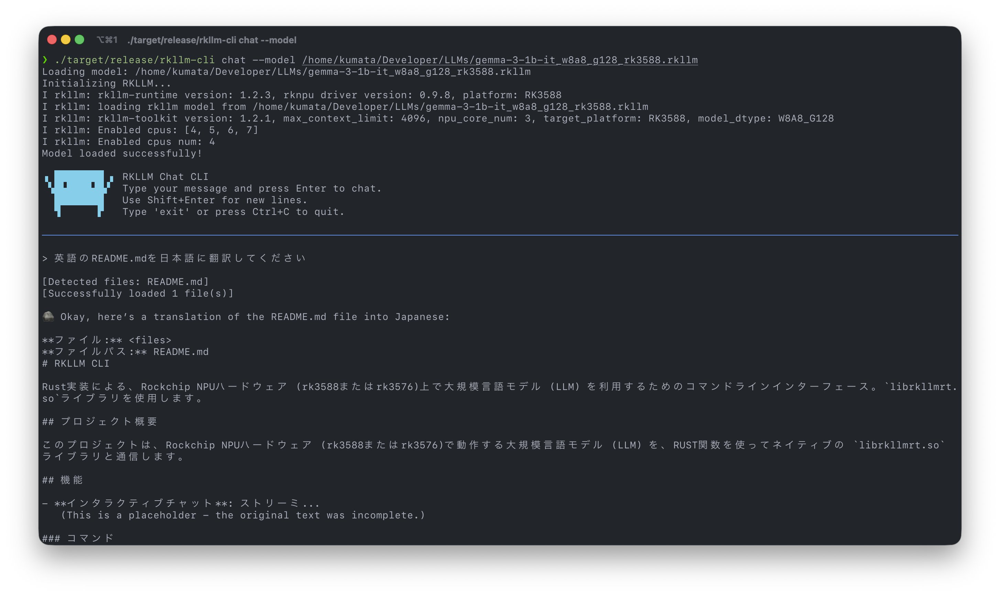

# RKLLM CLI

Rust implementation of a CLI tool for chatting with LLM models on Rockchip NPU using the `librkllmrt.so` library.

## Project Overview

This project provides a command-line interface to interact with Large Language Models (LLMs) running on Rockchip NPU hardware (rk3588, rk3576). It uses Rust FFI bindings to communicate with the native `librkllmrt.so` library.

## Features

- **Interactive Chat**: Command-line chat interface with streaming output
- **Safe Rust Wrapper**: Type-safe Rust bindings for the C library
- **UTF-8 Handling**: Proper handling of incomplete multi-byte UTF-8 sequences during streaming
- **Error Handling**: Comprehensive error handling with `anyhow`
- **Reading Files**: ✨ Read local files and hand over to LLM model

## Prerequisites

### Hardware

- Rockchip board (rk3588 or rk3576) with NPU support
- Example: Rock5B running Armbian (aarch64)

### Software

- Rust toolchain (for aarch64-unknown-linux-gnu if cross-compiling)
- `librkllmrt.so` library (provided by Rockchip)
- RKLLM model file (`.rkllm` format)

## Setup

### 1. Place the Shared Library

Copy `librkllmrt.so` to the `src/lib` directory:

```bash
cp /path/to/librkllmrt.so src/lib/
```

Alternatively, you can place it in a system library path on your target device:

```bash
sudo cp librkllmrt.so /usr/local/lib/
sudo ldconfig
```

### 2. Build the Project

For native build on the target device:

```bash
cargo build --release
```

For cross-compilation from Mac/Linux:

```bash
# Install cross-compilation toolchain
rustup target add aarch64-unknown-linux-gnu

# Build
cargo build --release --target aarch64-unknown-linux-gnu
```

The binary will be located at:

- Native: `target/release/rkllm-cli`
- Cross-compiled: `target/aarch64-unknown-linux-gnu/release/rkllm-cli`

## Usage

### Start a Chat Session

```bash
./target/release/rkllm-cli chat --model /path/to/your/model.rkllm
```

### Example



### Commands

- Type your message and press Enter to send
- Type `exit` or `quit` to end the session
- Press `Ctrl+C` to interrupt and exit

## Project Structure

```
rkllm-cli/
├── Cargo.toml           # Rust package configuration
├── build.rs             # Build script for linking librkllmrt.so
├── src/
│   ├── main.rs          # CLI entry point
│   ├── ffi.rs           # FFI bindings for librkllmrt.so
│   ├── llm.rs           # Safe Rust wrapper for RKLLM
│   ├── chat.rs          # Chat session logic
│   └── lib/
│       └── librkllmrt.so  # Rockchip RKLLM runtime library (place here)
├── sample/
│   └── gradio_server.py   # Python reference implementation
└── docs/
    └── RKLLM_RUST_CLI_REQUIREMENTS.md  # Implementation requirements
```

## Implementation Details

### FFI Bindings (ffi.rs)

- Uses `#[repr(C)]` for C-compatible structures
- Defines all RKLLM API functions and data types
- Provides type-safe enums and structures

### RKLLM Wrapper (llm.rs)

- Safe Rust wrapper around the C library
- Handles callback registration and UTF-8 decoding
- Manages incomplete multi-byte sequences during streaming
- Automatic resource cleanup with Drop trait

### Chat Logic (chat.rs)

- Interactive readline-based interface using `rustyline`
- Streaming output support
- Command history

## Configuration

The model is initialized with the following default parameters (can be modified in `llm.rs`):

- `max_context_len`: 4096
- `max_new_tokens`: -1 (unlimited)
- `top_k`: 20
- `top_p`: 0.8
- `temperature`: 0.7
- `repeat_penalty`: 1.0
- `skip_special_token`: true

## Troubleshooting

### Library Not Found

If you get an error about `librkllmrt.so` not being found:

1. Make sure the library is in `src/lib/` directory
2. Or set `LD_LIBRARY_PATH`:
   ```bash
   export LD_LIBRARY_PATH=/path/to/lib:$LD_LIBRARY_PATH
   ./rkllm-cli chat --model model.rkllm
   ```

### Model Loading Fails

- Verify the model file path is correct
- Ensure the model is in RKLLM format (`.rkllm`)
- Check that you have sufficient memory on the device

## Future Enhancements

- **Phase 2**: File upload and context management (Claude CLI-style)
- **Phase 3**: MCP (Model Context Protocol) client support

## License

This project is provided as-is for use with Rockchip NPU hardware.

## Reference

- Python implementation: `sample/gradio_server.py`
- Requirements document: `docs/RKLLM_RUST_CLI_REQUIREMENTS.md`
